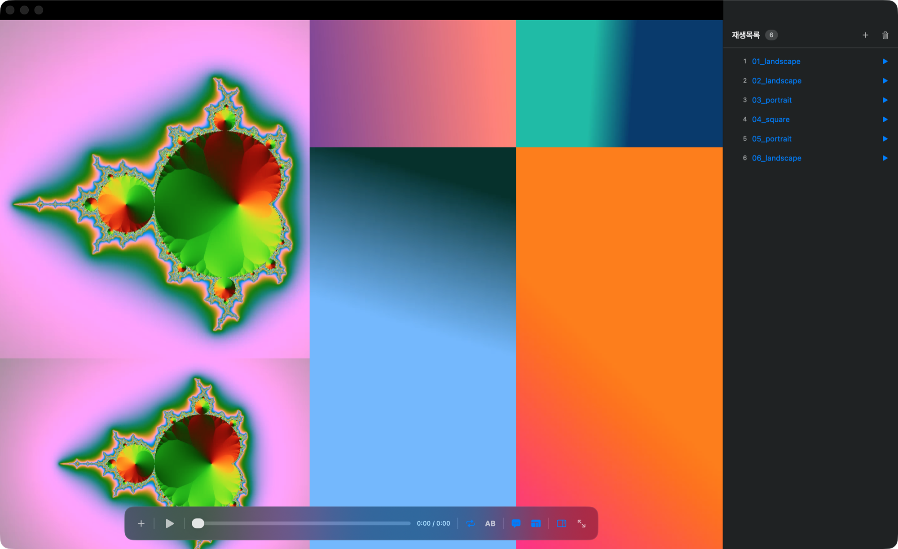
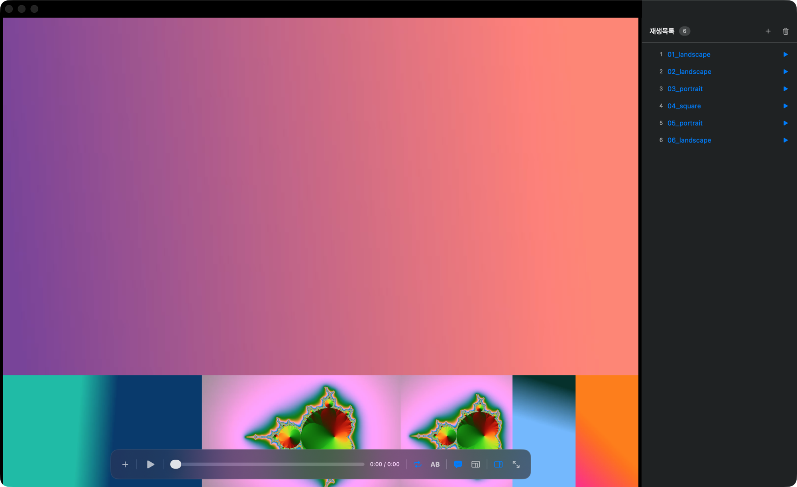

# Tilo

여러 개의 동영상을 동시에 재생하고, 영상 개수에 따라 전체 화면을 자동 분할하여 최적의 레이아웃으로 배치하는 macOS용 멀티 비디오 플레이어.



<details>
<summary>원본 비율 모드 (잘림 없이 레터박스)</summary>


</details>

## 핵심 기능

- 여러 동영상 동시 로드 (열기 패널 또는 드래그 앤 드롭)
- 모든 영상 동시 재생 / 일시정지 (Space)
- 모든 영상 동시 탐색(Seek) — 최장 영상 길이를 기준으로 한 통합 타임라인
- 콜라주식 모자이크 배치(기본) — 가로/세로 분할을 섞은 이진 분할 트리를 탐색해서 화면을 빈틈 없이 100% 채움. 트리의 화면비가 창 화면비에 가까울수록 크롭이 줄어드는 성질을 이용해, 모든 영상이 균등하게 최소한만 잘리는 트리를 찾는다 (전수 탐색 + 행/열 구성 시드 + 확률 탐색)
- 원본 비율 모드 — 컨트롤 바 토글로 전환. 행 높이가 다른 저스티파이드 레이아웃으로 잘림 없이 빈 공간을 최소화
- 전체화면 지원 (⌘F)
- 화면 비율에 맞는 자동 레이아웃 계산 — 창 크기를 바꾸면 실시간 재계산
- 영상 추가/삭제 시 실시간 재배치
- 개별 영상 음소거·제거 (영상 위에 마우스를 올리면 컨트롤 표시)
- 개별 재생바 — 호버 시 하단에 미니 시크바가 나타나 영상별로 위치 조정
- 반복재생(기본 켜짐) — 먼저 끝난 영상은 각자 처음부터 다시 재생. 컨트롤 바에서 전역 토글
- 오디오 솔로 — 영상을 클릭하면 그 영상만 소리가 나고 나머지는 음소거 (강조 테두리 표시). 다시 클릭하면 해제
- 더블클릭 확대 — 영상을 더블클릭하면 원본 비율로 단독 표시 + 오디오 솔로, 다시 더블클릭하면 모자이크로 복귀
- 전체 동기화 — 개별 시크로 어긋난 영상들을 전체 타임라인 위치로 한 번에 재정렬
- 몰입형 UI — 타이틀바 없는 창, 재생 중 마우스가 멈추면 컨트롤 바·개별 컨트롤·커서가 자동으로 숨음
- 재생목록 (P) — 우측 패널. 영상을 열면 같은 폴더의 영상들이 자동 등록되고, 더블클릭으로 화면에 추가/제거. 폴더를 드래그하거나 열기에서 선택하면 폴더 전체가 목록에 등록
- A-B 구간반복 (R) — 한 번 누르면 시작점, 두 번째에 끝점 설정과 동시에 반복 시작, 세 번째에 해제. 슬라이더에 주황색 마커 표시
- 자막 (C) — 영상과 같은 이름의 .srt/.smi 파일 자동 인식 (movie.ko.srt 같은 언어 코드, CP949 인코딩 지원). 외부 자막이 없으면 내장 자막 트랙 사용
- 드래그로 자리 교환 — 영상을 끌어 다른 영상 위에 올리면 두 자리가 맞바뀜 (드래그 중 실시간 미리보기)
- MKV/WebM 자동 변환 — ffmpeg가 설치되어 있으면(`brew install ffmpeg`) 가져올 때 재인코딩 없이 MP4로 자동 리먹스 후 재생. 결과는 캐시되어 같은 파일은 즉시 열림. MP4가 못 담는 오디오(Vorbis/Opus)는 AAC로만 변환
- 안정성 — 창을 닫으면 앱 종료, 재생 불가 파일은 셀에 안내 표시, 같은 영상 중복 추가 방지, 호버 시 파일명 표시
- 시간 표시 — 전역 타임라인과 개별 시크바에 현재/전체 시간
- 로컬 비디오 파일 지원 (AVFoundation이 지원하는 모든 포맷)

## 실행

```sh
./scripts/build-app.sh
open build/Tilo.app
```

macOS 13 이상, Swift 5.9 이상 필요. 개발 중에는 `swift run -c release`로도 실행할 수 있습니다. MKV/WebM 재생에는 ffmpeg가 필요합니다 (`brew install ffmpeg`).

영어·일본어·중국어(간체)를 지원하며 시스템 언어를 따라갑니다. ([English README](README.md))

## 단축키

| 키 | 동작 |
|---|---|
| ⌘O | 동영상 열기 |
| Space | 모두 재생 / 일시정지 |
| ← / → | 5초 뒤로 / 앞으로 |
| ⇧← / ⇧→ | 30초 뒤로 / 앞으로 |
| 0–9 | 전체 타임라인의 0%–90% 지점으로 점프 |
| L | 반복재생 토글 |
| M | 전체 음소거 토글 |
| S | 모든 영상 동기화 |
| A | 꽉 채우기 / 원본 비율 전환 |
| F | 전체화면 전환 |
| Esc | 확대 해제 |

## 구조

- `TiloApp.swift` — 앱 진입점과 메뉴 커맨드
- `PlayerManager.swift` — 영상 목록과 동시 재생/일시정지/탐색 상태 관리
- `GridLayout.swift` — 영상 개수와 컨테이너 크기에 따른 최적 격자 계산
- `ContentView.swift` — 격자 배치, 컨트롤 바, 드래그 앤 드롭
- `VideoCell.swift` — `AVPlayerLayer` 기반 개별 영상 셀과 호버 컨트롤
