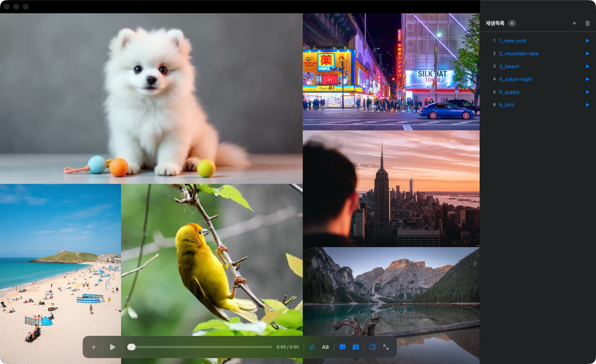
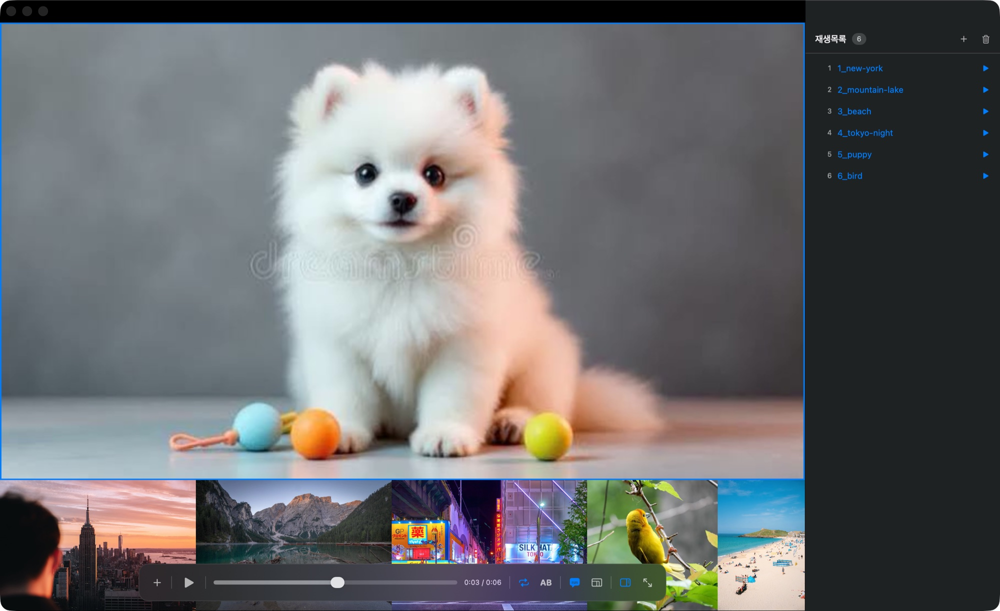

# Tilo

여러 개의 동영상을 동시에 재생하고, 영상 개수에 따라 전체 화면을 자동 분할하여 최적의 레이아웃으로 배치하는 macOS용 멀티 비디오 플레이어.



<details>
<summary>원본 비율 모드 (잘림 없이 레터박스)</summary>


</details>

## 핵심 기능

- 여러 동영상 동시 로드 (열기 패널 또는 드래그 앤 드롭)
- 모든 영상 동시 재생 / 일시정지 (Space)
- 모든 영상 동시 탐색(Seek) — 최장 영상 길이를 기준으로 한 통합 타임라인
- 콜라주식 모자이크 배치(기본) — 가로/세로 분할을 섞은 이진 분할 트리를 탐색해서 화면을 빈틈 없이 100% 채움. 트리의 화면비가 창 화면비에 가까울수록 크롭이 줄어드는 성질을 이용해, 모든 영상이 균등하게 최소한만 잘리는 트리를 찾는다 (전수 탐색 + 행/열 구성 시드 + 확률 탐색)
- 원본 비율 모드 — 컨트롤 바 토글로 전환. 행 높이가 다른 저스티파이드 레이아웃으로 잘림 없이 빈 공간을 최소화
- 전체화면 지원 (⌘F)
- 화면 비율에 맞는 자동 레이아웃 계산 — 창 크기를 바꾸면 실시간 재계산
- 영상 추가/삭제 시 실시간 재배치
- 개별 영상 음소거·제거 (영상 위에 마우스를 올리면 컨트롤 표시)
- 개별 재생바 — 호버 시 하단에 미니 시크바가 나타나 영상별로 위치 조정
- 반복재생(기본 켜짐) — 먼저 끝난 영상은 각자 처음부터 다시 재생. 컨트롤 바에서 전역 토글
- 오디오 솔로 — 타일의 헤드폰 버튼을 누르면 그 영상만 소리가 나고 나머지는 음소거
- 더블클릭 확대 — 영상을 더블클릭하면 원본 비율로 단독 표시 + 오디오 솔로, 다시 더블클릭하면 모자이크로 복귀
- 전체 동기화 — 개별 시크로 어긋난 영상들을 전체 타임라인 위치로 한 번에 재정렬
- 몰입형 UI — 타이틀바 없는 창, 재생 중 마우스가 멈추면 컨트롤 바·개별 컨트롤·커서가 자동으로 숨음
- 컨트롤 즉시 숨김 — 하단 바의 아래쪽 화살표 또는 `H`를 누르면 일시정지 중에도 즉시 숨기고, 마우스를 움직이면 다시 표시. 자동 숨김 시간은 설정에서 조절
- 재생목록 (P) — 우측 패널. 영상을 열면 같은 폴더의 영상들이 자동 등록되고, 더블클릭으로 화면에 추가/제거. 모자이크 타일을 선택한 뒤 재생목록의 교체 버튼을 누르면 기존 자리·화면/오디오 설정·재생 위치를 유지한 채 영상만 교체. 폴더를 드래그하거나 열기에서 선택하면 폴더 전체가 목록에 등록
- A-B 구간반복 (R) — 한 번 누르면 시작점, 두 번째에 끝점 설정과 동시에 반복 시작, 세 번째에 해제. 슬라이더에 주황색 마커 표시
- 오디오·자막 트랙 선택 — Inspector에서 다국어 오디오, 별도 .srt/.smi 자막, 영상에 포함된 자막을 선택. 선택값은 Tilo 프로젝트에 저장되고 모자이크 내보내기에도 선택한 오디오가 반영됨
- 자막 (C) — 영상과 같은 이름의 .srt/.smi 파일 자동 인식 (movie.ko.srt 같은 언어 코드, CP949 인코딩 지원). 자동 선택은 외부 자막을 우선하고 없으면 내장 자막 사용. Inspector에서 외부·내장 자막 크기를 50~200%로 조절
- 드래그로 자리 교환 — 영상을 끌어 다른 영상 위에 올리면 두 자리가 맞바뀜 (드래그 중 실시간 미리보기)
- 비교 도구 — 개별 영상의 시간 오프셋으로 미세 정렬, 모든 영상 프레임 단위 이동(`,`/`.`), 모자이크 전체를 깨끗한 이미지로 저장(`⌥⌘S`, ~/Pictures/Tilo)
- 전역 볼륨 조절, 타일 90° 회전
- 화면 배치 선택 — 자동 모자이크 / 고정 그리드(2×2·3×3·4×4) / 원본 비율
- 세션 복원 — 다시 열면 마지막에 보던 영상 구성을 자동 복원. 최근 항목 메뉴
- Tilo 프로젝트(.tilo) — 영상 구성, 재생목록, 자리 교환, 시간 오프셋, 회전, 확대·이동, 볼륨, 레이아웃, A-B 구간과 재생 위치를 저장/복원. 이동된 파일은 폴더를 지정해 다시 연결
- 선택 영상 Inspector — 타일을 클릭해 선택하고 사이드바에서 미디어 정보, 볼륨·솔로, 시간 오프셋, 회전, 확대를 한곳에서 조절
- 모자이크 영상 내보내기 — 현재 배치·크롭/원본비율·회전·확대/이동·시간 오프셋·반복·상대 타임라인을 반영해 1080p H.264 MP4로 저장. 현재 들리는 영상들의 오디오를 믹스하며 진행률·취소 지원
- 키보드 단축키 도움말 (`?`)
- 폭넓은 파일 호환 — MP4/MOV/M4V/AVI/MKV/WebM/WMV/FLV/MPEG/VOB/TS/MTS/M2TS/OGV/3GP/MXF 등을 인식. 먼저 AVFoundation으로 원본을 열고, 실험적 원본 직접 재생을 켜면 AVFoundation이 거부한 파일도 libmpv로 변환 없이 재생. libmpv 재생까지 실패한 경우에만 ffmpeg의 캐시된 무손실 MP4 리먹스 또는 H.264/AAC 변환으로 전환
- 안정성 — 창을 닫으면 앱 종료, 재생 불가 파일은 셀에 안내 표시, 같은 영상 중복 추가 방지, 호버 시 파일명 표시
- 시간 표시 — 전역 타임라인과 개별 시크바에 현재/전체 시간
- 로컬 비디오 파일 지원 (AVFoundation이 지원하는 모든 포맷)

## 실행

```sh
brew install mpv ffmpeg
./scripts/build-app.sh
open build/Tilo.app
```

macOS 13 이상, Swift 5.9 이상 필요. 현재 소스 빌드는 Homebrew의 libmpv에 연결되므로 **설정 → 지원하지 않는 파일 원본 직접 재생**을 꺼도 `mpv`가 빌드 필수 항목입니다. `ffmpeg`는 호환 변환과 모자이크 영상 내보내기에 사용합니다. 직접 재생을 끄면 AVFoundation에서 실패한 파일을 바로 호환 변환합니다.

> **실험 빌드 주의:** `build-app.sh`는 설치된 Homebrew libmpv에 동적으로 연결하는 개발용 앱을 만들며, 아직 단독 배포 가능한 번들은 아닙니다. 실행할 Mac에도 호환되는 Homebrew mpv가 필요합니다. 재배포 전에는 호환 라이브러리 포함·서명 방법과 GPL 구성 요소가 포함될 수 있는 전체 의존성의 라이선스를 별도로 검토해야 합니다.

영어·일본어·중국어(간체)를 지원하며 시스템 언어를 따라갑니다. ([English README](README.md))

## 단축키

| 키 | 동작 |
|---|---|
| ⌘N | 새 프로젝트 |
| ⌘O | 동영상 열기 |
| ⇧⌘O | Tilo 프로젝트 열기 |
| ⌘S | 프로젝트 저장 |
| ⇧⌘S | 프로젝트를 다른 이름으로 저장 |
| Space | 모두 재생 / 일시정지 |
| ← / → | 5초 뒤로 / 앞으로 |
| ⇧← / ⇧→ | 30초 뒤로 / 앞으로 |
| , / . | 이전 / 다음 프레임 |
| 0–9 | 전체 타임라인의 0%–90% 지점으로 점프 |
| L | 반복재생 토글 |
| R | 구간반복 (A→B→해제) |
| M | 전체 음소거 토글 |
| S | 모든 영상 동기화 |
| ⌥⌘S | 모자이크 스냅샷 저장 |
| ⇧⌘E | 모자이크 영상 내보내기 |
| A | 꽉 채우기 / 원본 비율 전환 |
| C | 자막 토글 |
| P | 사이드바 토글 |
| H | 하단 컨트롤 막대 숨기기 / 보기 |
| F | 전체화면 전환 |
| Esc | 확대 해제 |
| ? | 단축키 도움말 |

## 구조

- `TiloApp.swift` — 앱 진입점과 메뉴 커맨드
- `PlayerManager.swift` — 영상 목록과 동시 재생/일시정지/탐색 상태 관리
- `MPVPlaybackEngine.swift` — 실험적 원본 직접 재생과 영상별 libmpv 코어 관리
- `MPVOpenGLView.swift` / `MpvBridge` — macOS용 libmpv Render API 화면
- `TiloProject.swift` — 버전이 있는 .tilo 프로젝트 모델과 검증·직렬화
- `MediaTracks.swift` — 오디오·자막 트랙 표시와 프로젝트 선택 상태
- `GridLayout.swift` — 영상 개수와 컨테이너 크기에 따른 최적 격자 계산
- `ContentView.swift` — 격자 배치, 컨트롤 바, 드래그 앤 드롭
- `VideoCell.swift` — `AVPlayerLayer` 기반 개별 영상 셀과 호버 컨트롤
- `SidebarView.swift` — 재생목록/선택 영상 Inspector 사이드바
- `MosaicExporter.swift` — 현재 배치와 재생 설정을 H.264/AAC MP4로 합성
